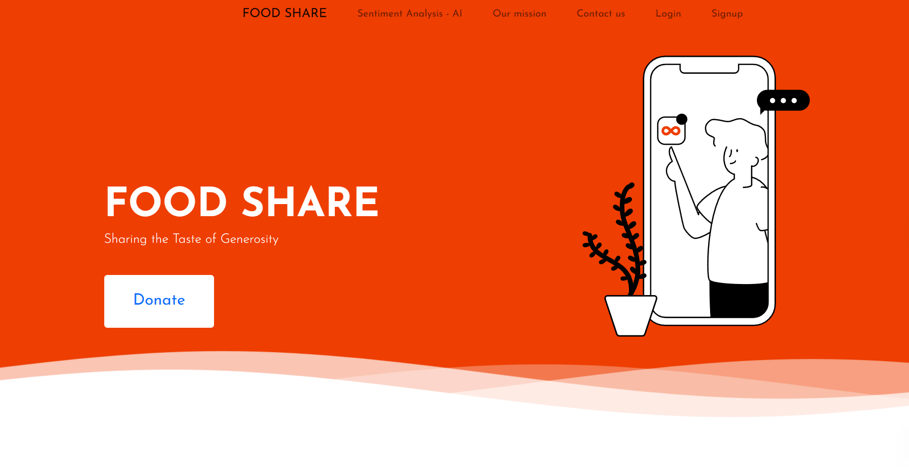

 FoodShare 
FoodShare: A MERN Stack Food Donation Platform

Food Share: Nourishing Communities, One Plate at a Time

Use Cases :

1. Efficient Food Management:
   - Scenario: Restaurant, Hostel Mess or any individual can lists surplus food on FoodShare platform.
   - Use Case: Manager lists excess food, system matches with nearby shelters, volunteer agents pick up for redistribution.
2. Donor Participation Simplified:
   - Scenario: Individual across india can donates excess groceries.
   - Use Case: Donor submits food items on FoodShare app, system assigns volunteer agent for pickup and delivery.
3. Task Assignment to Agents:
   - Scenario: Admin manages donation pickups efficiently.
   - Use Case: Admin assigns tasks to volunteer agents based on availability and proximity, agents receive task details on FoodShare app for timely deliveries.

